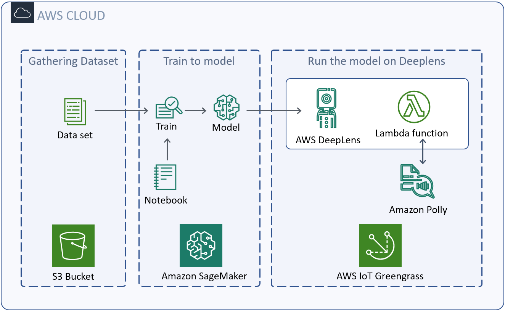
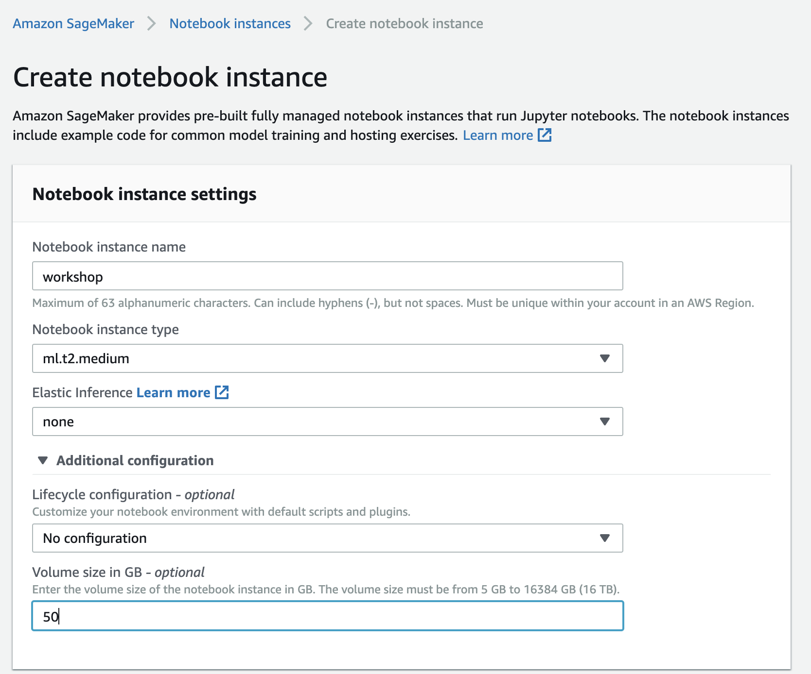
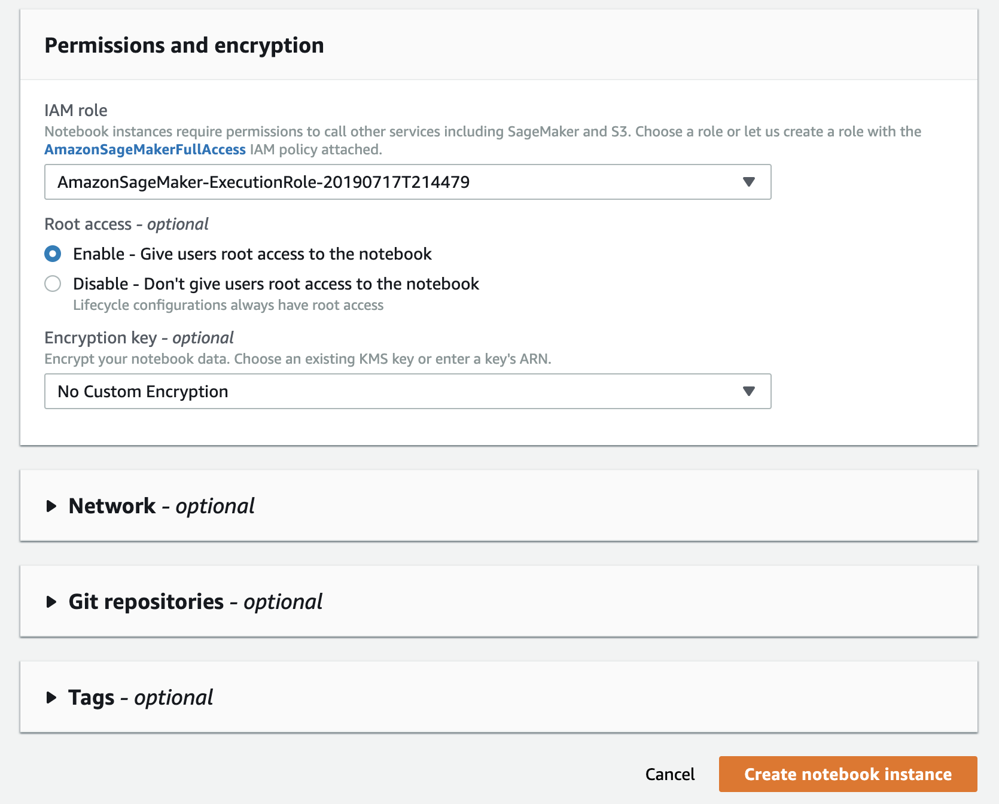
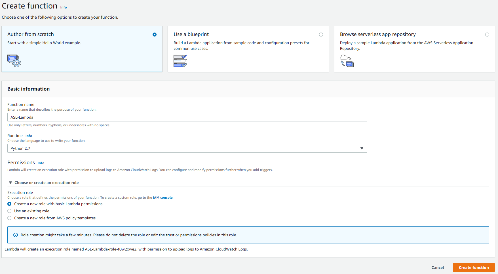
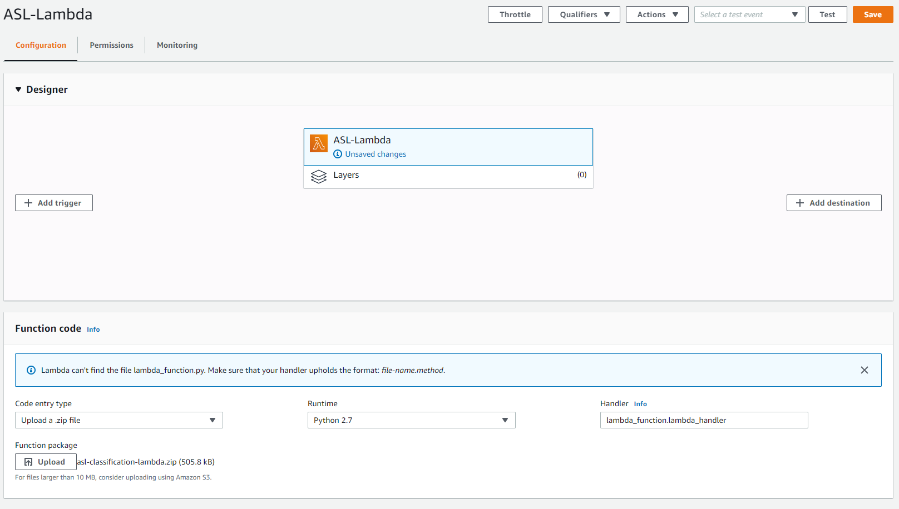
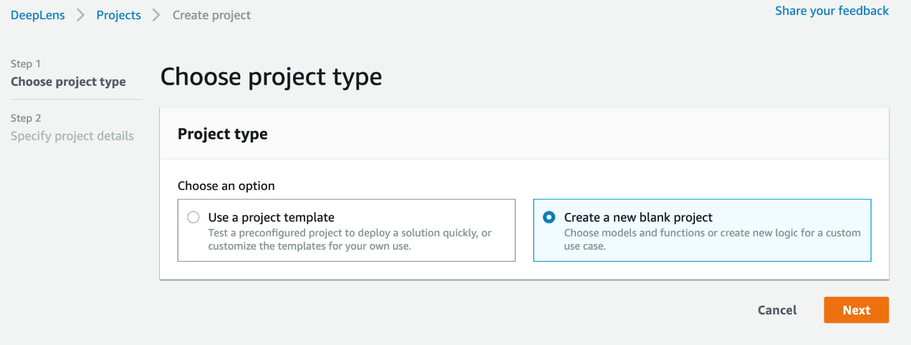
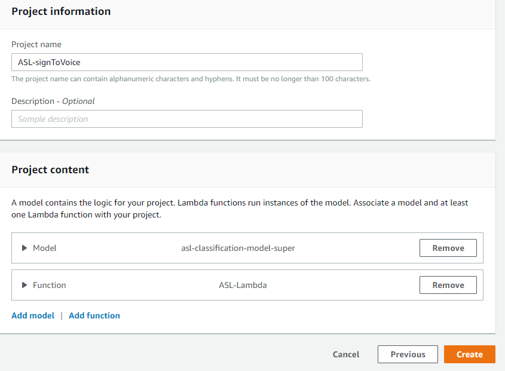
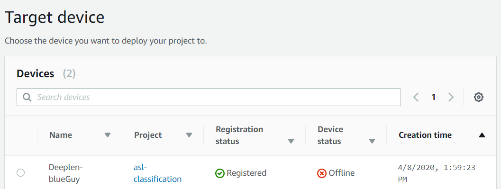
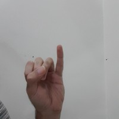

# DeepLens Sign to Voice Recipe

In this tutorial, you will learn how to create an image classification model with either your custom dataset or with the one provided and deploy it to your DeepLens. You’ll be able to sign in front of the DeepLens and it will convert sign language into audio file and will play the audio file.

### Solution Architecture


### Prerequisites

To complete this walkthrough, you must have the following:
- An AWS Account.
- An AWS DeepLens device.
- An external AUX/Bluetooth speaker/headset.

Step by step guideline to register your [AWS DeepLens device](https://docs.aws.amazon.com/deeplens/latest/dg/deeplens-getting-started.html).

To create a custom image classification model, we need to use a graphics processing unit (GPU) enabled training job instance. In order to access a GPU-enabled training job instance, you must submit a request for a service limit increase to the AWS Support Center. For this recipe we will use a single ml.p2.xlarge instance.

Request a GPU-enabled Amazon SageMaker Training Instance:
1.	Open the [AWS Support Center console](https://console.aws.amazon.com/support/home#/case/create).
2.	On the AWS Support Center page, choose **Create Case** and then choose **Service limit increase**.
3.	In the **Case classification** panel under **Limit type**, search for Amazon SageMaker.
4.	In the **Request** panel, choose the **Region** that you are working in. For **Resource** Type, choose **SageMaker Training**.
5.	For Limit choose **ml.p2.xlarge** instances.
6.	For New Limit Value, verify that the value is **1**.
7.	In **Case description**, provide a brief explanation of why you need the Service limit increase. For example, I need to use this GPU-enabled training job instance to train a deep learning model using TensorFlow. I’ll use this model on an AWS DeepLens device.
8.	In **Contact** options, provide some details about how you would like to be contacted by the AWS service support team on the status of your Service limit increase request.
9.	Choose **Submit**.

### Gather data
This walkthrough uses an ML algorithm called an [image classification algorithm](https://docs.aws.amazon.com/sagemaker/latest/dg/image-classification.html). These models learn to distinguish between different objects by observing many examples over many iterations. A good practice for collecting images is to use pictures at different possible angles and lighting conditions to improve accuracy. Here is an example of the sign ‘A’ in different lightings and postures.

When you have images for each type of sign, sort them into separate folders. For example:

>images
>>A
>>>A1.jpg  
A2.jpg
>
>>B
>>>B1.jpg

The recommended input format for Amazon Sagemaker image classification algorithm is Apache MXNet [RecordIO](https://mxnet.apache.org/api/faq/recordio).
After you have the data you would like to train your ML model on, upload them to Amazon S3. First, create an S3 bucket. For AWS DeepLens projects, the S3 bucket names must start with the prefix **deeplens-**. Create folders **train** and **validation** within the bucket and upload your data.

```
python im2rec.py ./<prefix> ./<path>/ --recursive --list --num-thread=8 --train-ratio=0.8 --test-ratio=0.2
python im2rec.py ./<prefix> ./<path>/ --recursive --num-thread=8 --pass-through --pack-label
```
The above is an example of using im2rec.py to format your data into .rec format and also splitting the data into train/test.

*This recipe provides a dataset of images in .rec format.*

### Train the model

This recipe uses Amazon SageMaker Jupyter notebooks as the development environment to train your models. Jupyter Notebook is an open-source web application that allows you to create and share documents that contain live code, equations, visualizations, and narrative text. A full Jupyter notebook has been prepared for you to follow along.

*This recipe provides a Jupyter notebook to follow along.*

To create a custom image classification model, you need to use a graphics processing unit (GPU) enabled training job instance. GPUs are excellent at parallelizing the computations required to train a neural network. This tutorial uses a single **ml.p2.xlarge** instance. In order to access a GPU-enabled training job instance, you must submit a request for a service limit increase to the AWS Support Center (covered in Prerequisites).

After you have received your limit increase, [Launch your Amazon SageMaker notebook instance](https://docs.aws.amazon.com/sagemaker/latest/dg/gs-setup-working-env.html).

- Use a **t2.medium** instance type, which is included in the Amazon SageMaker free tier. For more information, see [Amazon SageMaker Pricing](https://aws.amazon.com/sagemaker/pricing/).
- When you create a role, reference the S3 bucket the project uses (prefix deeplens-).
Enter a name for your notebook instance, leave everything else the default except for the volume size. Enter volume size of 50 GB or more because we’ll first download the data to our notebook instance before uploading the data to Amazon S3.





If you are using Amazon SageMaker for the first time, please create an IAM role by choosing “Create a new role” from the selection list.


On the pop-up menu, select Any S3 bucket to allow the notebook instance to any S3 buckets in your account. Then, click on “Create role” button on the bottom.

Your notebook instance will take a minute to be configured. Once you see the status change to **InService** on the Notebook instances page, choose **Open Jupyter** to launch your newly created Jupyter notebook instance.

You should see the page below:


Create a new notebook by choosing **New** and **conda_mxnet_p36 kernel**.

If you’re new to Jupyter notebooks, you will notice that it contains mixture of text and code cells. To run a piece of code, select the cell and then press shift + enter. While the cell is running an asterisk will appear next to the cell. Once complete, an output number and new output cell will appear below the original cell.

Let’s start by importing the necessary packages. Importing boto3 SDK for Python allows you to access Amazon services like S3. get_execution_role will allow Amazon SageMaker to assume the role created during instance creation and accesses resources on your behalf.
~~~
%%time 
import boto3
from sagemaker import get_execution_role
role = get_execution_role()
~~~
Next we define a bucket which hosts the dataset that will be used. In the previous steps, an S3 bucket was created. The name for your bucket must contain the prefix ‘deeplens-’. In this example, the bucket is ‘deeplens-asl-classification’.
~~~
bucket='deeplens-asl-classification' 
~~~
Next we define the containers. Containers are docker containers and the training job defined in this notebook will run in the container for your region.
~~~
containers = {'us-west-2': '433757028032.dkr.ecr.us-west-2.amazonaws.com/image-classification:latest',
              'us-east-1': '811284229777.dkr.ecr.us-east-1.amazonaws.com/image-classification:latest',
              'us-east-2': '825641698319.dkr.ecr.us-east-2.amazonaws.com/image-classification:latest',
              'eu-west-1': '685385470294.dkr.ecr.eu-west-1.amazonaws.com/image-classification:latest'}
training_image = containers[boto3.Session().region_name]
~~~
Next let’s define the network that we will use to train the dataset. For this tutorial, we will use ResNet network. ResNet is the default image classification model in Amazon SageMaker. In this step, you can customize the hyper parameters of the network to train your dataset.

num_layers lets you define the network depth. ResNet supports multiple network depths. For example: 18, 34, 50, 101, 152, 200 etc. For this example we choose the default network depth as 50.

Next we need to specify the input image dimensions. The dataset that we used in this example has the dimensions 224 x 224 and has 3 color channels: RGB.

Next we specify the number of training samples in the training set. For this dataset, the number of samples in the training dataset after 80-20 split is 46080 images.

Next, we specify the number of output classes for the model. In this example, the number of output classes is 24 (24 Letters).

Batch size refers to the number of training examples utilized in one iteration. You can customize this number based on the computation resources available to you. Epoch is when the entire dataset is processed by the network once. Learning rate determines how fast the weights or coefficients of your network change. You can customize batch size, epochs and learning rates. You can refer to the definitions here: https://docs.aws.amazon.com/sagemaker/latest/dg/IC-Hyperparameter.html.
~~~
# The algorithm supports multiple network depth (number of layers). They are 18, 34, 50, 101, 152 and 200
# For this training, we will use 50 layers
num_layers = "50" 
# we need to specify the input image shape for the training data
image_shape = "3,224,224"
# we also need to specify the number of training samples in the training set
num_training_samples = "46080"
# specify the number of output classes
num_classes = "24"
# batch size for training
mini_batch_size =  "64"
# number of epochs
epochs = "4"
# learning rate
learning_rate = "0.1"
#optimizer
optimizer ='Adam'
#checkpoint_frequency
checkpoint_frequency = "4"
#scheduler_step
lr_scheduler_step="2,4"
#scheduler_factor
lr_scheduler_factor="0.1"
#augmentation_type
augmentation_type="crop"
~~~
Next, we will create the training job. The training job requires the following:
- The URL of the Amazon Simple Storage Service (Amazon S3) bucket where you’ve stored the training data.
- The compute resources that you want Amazon SageMaker to use for model training. Compute resources are ML compute instances that are managed by Amazon SageMaker.
- The URL of the S3 bucket where you want to store the output of the job.
- The Amazon Elastic Container Registry path where the training code is stored.

Please make a note of job_name_prefix, S3OutputPath, InstanceType, InstanceCount.
~~~
%%time
import time
import boto3
from time import gmtime, strftime


s3 = boto3.client('s3')
# create unique job name 
job_name_prefix = 'DEMO-asl-classification'
timestamp = time.strftime('-%Y-%m-%d-%H-%M-%S', time.gmtime())
job_name = job_name_prefix + timestamp
training_params = \
{
    # specify the training docker image
    "AlgorithmSpecification": {
        "TrainingImage": training_image,
        "TrainingInputMode": "File"
    },
    "RoleArn": role,
    "OutputDataConfig": {
        "S3OutputPath": 's3://{}/{}/output'.format(bucket, job_name_prefix)
    },
    "ResourceConfig": {
        "InstanceCount": 1,
        "InstanceType": "ml.p2.xlarge",
        "VolumeSizeInGB": 50
    },
    "TrainingJobName": job_name,
    "HyperParameters": {
        "image_shape": image_shape,
        "num_layers": str(num_layers),
        "num_training_samples": str(num_training_samples),
        "num_classes": str(num_classes),
        "mini_batch_size": str(mini_batch_size),
        "epochs": str(epochs),
        "learning_rate": str(learning_rate),
        "lr_scheduler_step": str(lr_scheduler_step),
        "lr_scheduler_factor": str(lr_scheduler_factor),
        "augmentation_type": str(augmentation_type),
        "checkpoint_frequency": str(checkpoint_frequency),
        "augmentation_type" : str(augmentation_type)
    },
    "StoppingCondition": {
        "MaxRuntimeInSeconds": 360000
    },
#Training data should be inside a subdirectory called "train"
#Validation data should be inside a subdirectory called "validation"
#The algorithm currently only supports fullyreplicated model (where data is copied onto each machine)
    "InputDataConfig": [
        {
            "ChannelName": "train",
            "DataSource": {
                "S3DataSource": {
                    "S3DataType": "S3Prefix",
                    "S3Uri": 's3://{}/train/'.format(bucket),
                    "S3DataDistributionType": "FullyReplicated"
                }
            },
            "ContentType": "application/x-recordio",
            "CompressionType": "None"
        },
        {
            "ChannelName": "validation",
            "DataSource": {
                "S3DataSource": {
                    "S3DataType": "S3Prefix",
                    "S3Uri": 's3://{}/validation/'.format(bucket),
                    "S3DataDistributionType": "FullyReplicated"
                }
            },
            "ContentType": "application/x-recordio",
            "CompressionType": "None"
        }
    ]
}
print('Training job name: {}'.format(job_name))
print('\nInput Data Location: {}'.format(training_params['InputDataConfig'][0]['DataSource']['S3DataSource']))
~~~
The next step creates the training job and allows you to check the status of the Job in CloudWatch.
~~~
# create the Amazon SageMaker training job
sagemaker = boto3.client(service_name='sagemaker')
sagemaker.create_training_job(**training_params)

# confirm that the training job has started
status = sagemaker.describe_training_job(TrainingJobName=job_name)['TrainingJobStatus']
print('Training job current status: {}'.format(status))

try:
    # wait for the job to finish and report the ending status
    sagemaker.get_waiter('training_job_completed_or_stopped').wait(TrainingJobName=job_name)
    training_info = sagemaker.describe_training_job(TrainingJobName=job_name)
    status = training_info['TrainingJobStatus']
    print("Training job ended with status: " + status)
except:
    print('Training failed to start')
     # if exception is raised, that means it has failed
    message = sagemaker.describe_training_job(TrainingJobName=job_name)['FailureReason']
    print('Training failed with the following error: {}'.format(message))
~~~
Click on the Run button in the top toolbar to execute the code/text in that section. Continue clicking the run button for subsequent cells until you get to the bottom of the notebook. Alternatively, you can also use the keyboard shortcuts Shift + Enter.

As each section runs, it will spit out log output of what it’s doing. Sometimes you’ll see a [ * ] on the left hand side. This means that the code is still running. Once the code is done running, you’ll see a number. This number represents the order in which the code was executed.

To check the status, go to SageMaker dashboard and choose Jobs. Select the Job you have defined and scroll down to the details page on Job to “monitor” section. You will see a link to logs which will open CloudWatch.

After you follow the notebook through to the end, you will have trained a model to distinguish between different signs.

### Import the model
Go to your AWS DeepLens console, go to **Models** and click on **Import model**.


Select **Amazon SageMaker trained model**. Then select your job ID and model name. Then select **MXNet** as your model framework.

Then click **Import model**.

### Create the inference function
Inference is a step through where you will provide the model images to predict the sign and to make it speak. For the inference function, you use [AWS Lambda](https://aws.amazon.com/lambda/) to create a function that you deploy to AWS DeepLens.
Lets start on creating the Lambda function.

*This recipe provides an example inference Lamda function.*

Download the zip file, go to [AWS Lambda console](https://console.aws.amazon.com/lambda/home) and click create function.


Choose **Author from scratch**, Runtime is **Python 2.7** and use an Existing Role.



Choose **Create Function**.
Once the function is created, scrolldown on the function's detail page and choose **Upload a .zip file** under **Code entry type**.
Upload the file from your pc.
Change Handler to signToVoice.lambda_handler and Save it.



Click on **Actions**, then **Publish a new version**. Publishing the function makes it available in the AWS DeepLens console so that you can add it to your custom project.
 
### Understanding the Lambda Function
***************
### Create a custom AWS DeepLens project
In your AWS DeepLens console’s Projects page, click on **Create Project**.
Choose the Blank Project option.



Name your project, then click **Add model** and select the model you just created., then click **Add function** and search for the AWS Lambda function you created earlier.



Select the project and click on **Deploy to your deeplens device**.


Select your **Target device** and proceed to **Review**.
Click on **Deploy**.



### Play sound through a Deeplens
SSH to your deeplens device and type the following commands in the terminal
```
sudo apt-get update
sudo apt-get install tesseract-ocr
sudo apt-get install python-gi
sudo pip install playsound
sudo apt-get install gstreamer1.0-plugins-bad
sudo apt-get install gstreamer1.0-plugins-ugly

```
### Trying it out!


**A**

**B**

**C**

**D**

**E**

**F**

**G**

**H**

**I**

**K**

**L**

**M**

**N**

**O**

**P**

**Q**

**R**

**S**

**T**

**U**

**V**

**W**

**X**

**Y**
